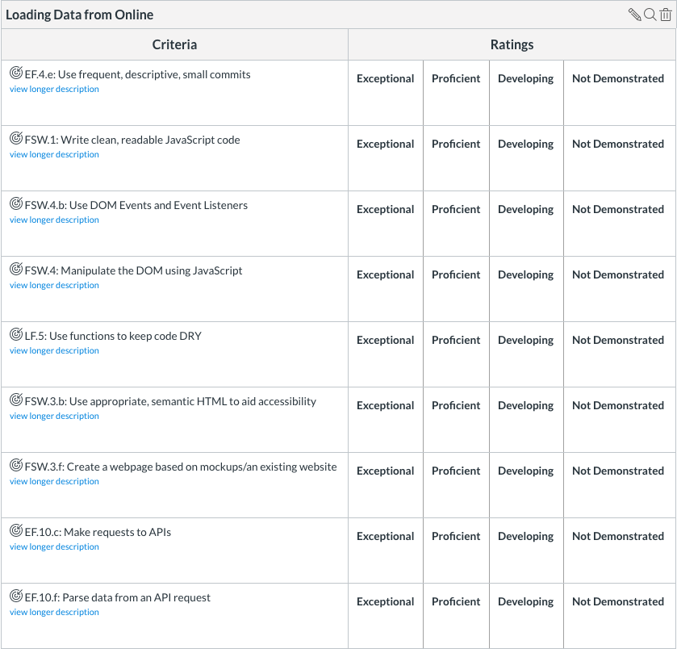

# Loading Data from API Lab - Pokemon Battle Simulator

## UI

Create an app that simulates Pokemon battles. 

Create a page with five items:

- An `h1` tag containing the words "Pokemon Battle Simulator"
- A button that displays the text "get pokemon!" and when clicked triggers the function "getPokemon"
- A button that displays the text "battle!" and when clicked triggers the function "battlePokemon"
- An empty `div` with the class `data`
- An `div` with the class `battleHistory` that contains a `h3` tag containing the words "Battle History"

Each time your user clicks the 'get pokemon' button and the following must occur:

- Call the PokéAPI api/v2/pokemon/{$pokemonID} endpoint **twice** to get the json data for two pokemon. These are your battlers. 
- For each of the two pokemon, the following information needs to be displayed
- The Pokemon's name
- The Pokemon's sprite
- The Pokemon's base HP stat. 
- The names and PP of **four** of the Pokemon's moves (either get the first four moves or at random)

Each time the 'get Pokemon' button is clicked, two new Pokemon should be displayed, and the old two Pokemon from the should no longer be displayed.

Each time your user clicks the 'battle' button, one of your two pokemon should be randomly selected as the winner. Add a description of the fight to the `battleHistory` section at the bottom.

## Endpoints

The PokéAPI is documented at https://pokeapi.co.

The two endpoints will be useful:

- api/v2/pokemon/{$pokemonID} endpoint documentation: https://pokeapi.co/docs/v2.html#pokemon
- api/v2/move/{$moveID} endpoint documentation https://pokeapi.co/docs/v2.html/#moves

#### Endpoints notes

- As of 9/12/2019, PokemonIDs range from 1 to 809.
- Within the 'sprites' json field, multiple sprites are present for each pokemon. Just use one sprite per pokemon.
- The HP base stat can be found within the 'stats' json field. 
- To get the PP of a move, you will need to call the api/v2//move/${moveID} endpoint to get the json data for a move.

## Styling

On top of default HTML styling, the app should have the following styles:

- **Entire App**

  - Fonts should be sans-serif.
  - The background color should be `lightblue`.
  - Everything should be in a column, justified center.

- **h1**

  - Include 30px of padding or margin on top.

- **data**
  - Should have a width of 600px.
  - The first pokemon should float left, the second pokemon should float right. 

For a video of how the page changes when the buttons are clicked visit https://youtu.be/_XVy4hRZ_Ig

## Rubric

## Bonus

- Add your own styling to the page to add extra polish
- Smooth out the loading animations
- If you are getting pokemon or pokemon moves at random, ensure that no duplicates are returned, i.e that it's impossible for your function to get a move more than once or the same pokemon to battle each other.
- When the battle button is pressed, have one of the pokemon 'attack' by using a move. Reflect this by decreasing the PP for that move by one, and lowering the HP of the pokemon that isn't attacking.

Contributor: Mauricio Rivera, mauricio@pursuit.org
